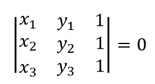

# 149. 直线上最多的点数

给定一个二维平面，平面上有 *n *个点，求最多有多少个点在同一条直线上。

**示例 1:**

```
输入: [[1,1],[2,2],[3,3]]
输出: 3
解释:
^
|
|        o
|     o
|  o  
+------------->
0  1  2  3  4

```

**示例 2:**

```
输入: [[1,1],[3,2],[5,3],[4,1],[2,3],[1,4]]
输出: 4
解释:
^
|
|  o
|     o        o
|        o
|  o        o
+------------------->
0  1  2  3  4  5  6
```

## 解决方案

判断三点共线就是判断下面这个等式是否成立：



```c++
class Solution {
public:
    int maxPoints(vector<Point>& points) {
        int res = 0;
        for (int i = 0; i < points.size(); ++i) {
            int duplicate = 1;
            for (int j = i + 1; j < points.size(); ++j) {
                int cnt = 0;
                long long x1 = points[i].x, y1 = points[i].y;
                long long x2 = points[j].x, y2 = points[j].y;
                if (x1 == x2 && y1 == y2) {++duplicate; continue;}
                for (int k = 0; k < points.size(); ++k) {
                    int x3 = points[k].x, y3 = points[k].y;
                    if (x1 * y2 + x2 * y3 + x3 * y1 - x3 * y2 - x2 * y1 - x1 * y3 == 0) {
                        ++cnt;
                    }
                }
                res = max(res, cnt);
            }
            res = max(res, duplicate);
        }
        return res;
    }
};
```

