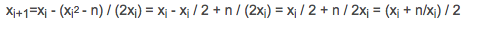

# 69. 求平方根

实现 `int sqrt(int x)` 函数。

计算并返回 *x* 的平方根，其中 *x *是非负整数。

由于返回类型是整数，结果只保留整数的部分，小数部分将被舍去。

**示例 1:**

```
输入: 4
输出: 2

```

**示例 2:**

```
输入: 8
输出: 2
说明: 8 的平方根是 2.82842..., 
     由于返回类型是整数，小数部分将被舍去。
```

## 解决方案

牛顿迭代

因为要求x2 = n的解，令f(x)=x2-n，相当于求解f(x)=0的解，可以求出递推式如下：




```c++
class Solution {
public:
    int mySqrt(int x) {
        if (x == 0) 
            return 0;
        double res = 1, pre = 0;
        while (abs(res - pre) > 1e-6) {
            pre = res;
            res = (res + x / res) / 2;
        }
        return int(res);   
    }
};
```

