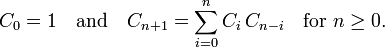

# 96. 不同的二叉搜索树

给定一个整数 *n*，求以 1 ... *n* 为节点组成的二叉**搜索树**有多少种？

**示例:**

```
输入: 3
输出: 5
解释:
给定 n = 3, 一共有 5 种不同结构的二叉搜索树:

   1         3     3      2      1
    \       /     /      / \      \
     3     2     1      1   3      2
    /     /       \                 \
   2     1         2                 3
```

解决方案

卡塔兰数

```
                    1                        n = 1

                2        1                   n = 2
               /          \
              1            2
  
   1         3     3      2      1           n = 3
    \       /     /      / \      \
     3     2     1      1   3      2
    /     /       \                 \
   2     1         2                 3
```

就跟斐波那契数列一样，我们把n = 0 时赋为1，因为空树也算一种二叉搜索树，那么n = 1时的情况可以看做是其左子树个数乘以右子树的个数，左右字数都是空树，所以1乘1还是1。那么n = 2时，由于1和2都可以为跟，分别算出来，再把它们加起来即可。n = 2的情况可由下面式子算出：

dp[2] =  dp[0] * dp[1]　　　(1为根的情况)

　　　　+ dp[1] * dp[0]　　  (2为根的情况)

同理可写出 n = 3 的计算方法：

dp[3] =  dp[0] * dp[2]　　　(1为根的情况)

　　　　+ dp[1] * dp[1]　　  (2为根的情况)

 　　　  + dp[2] * dp[0]　　  (3为根的情况)

由此可以得出卡塔兰数列的递推式为：



```c++
class Solution {
public:
    int numTrees(int n) {
        vector<int> dp(n + 1, 0);
        dp[0] = 1;
        dp[1] = 1;
        for (int i = 2; i <= n; ++i) {
            for (int j = 0; j < i; ++j) {
                dp[i] += dp[j] * dp[i - j - 1];
            }
        }
        return dp[n];
    }
};
```

